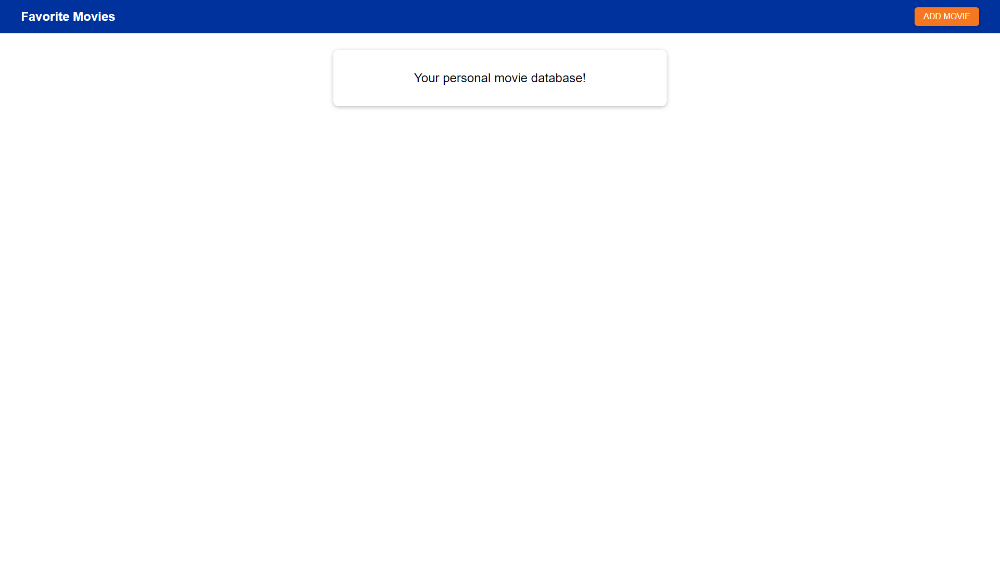
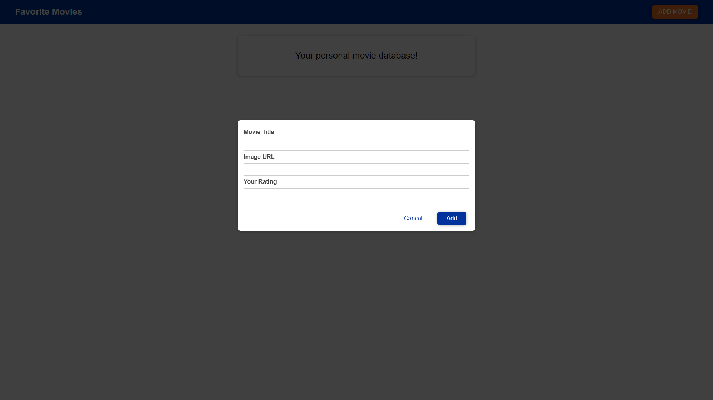
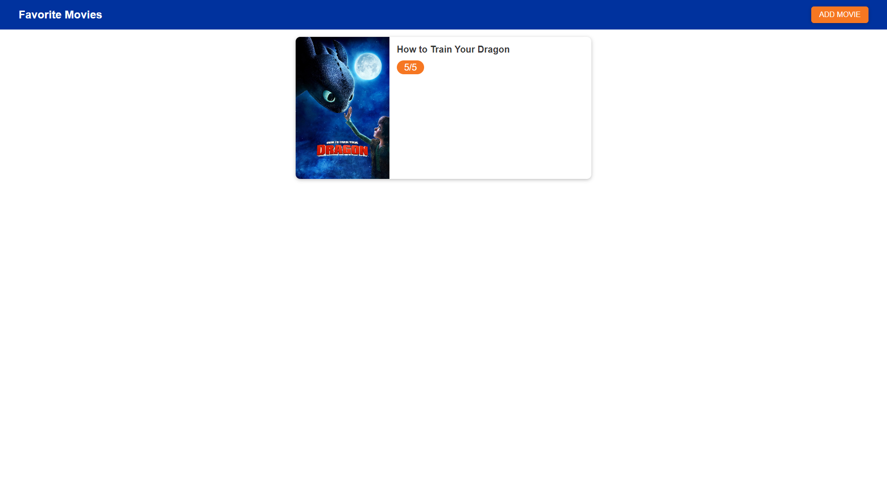
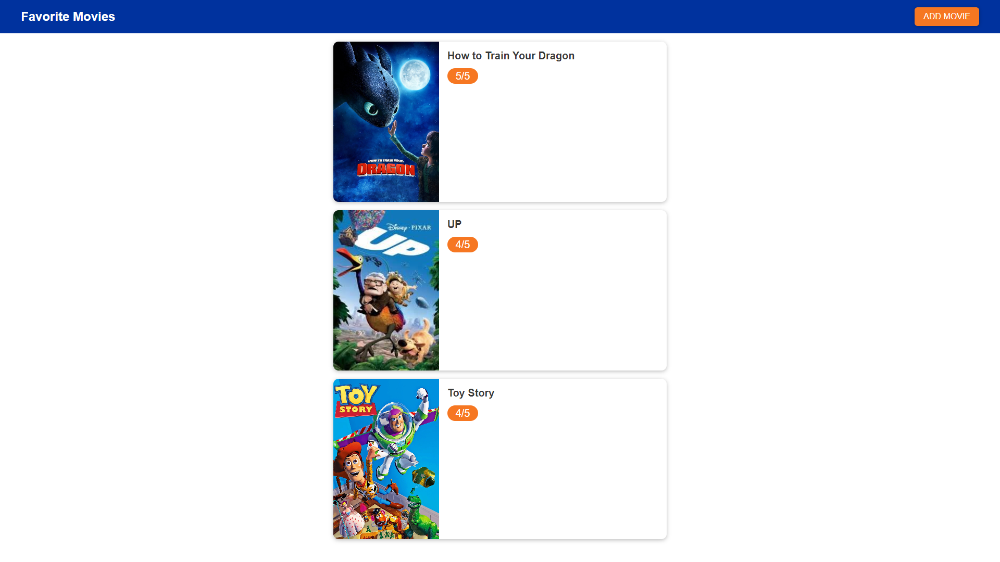
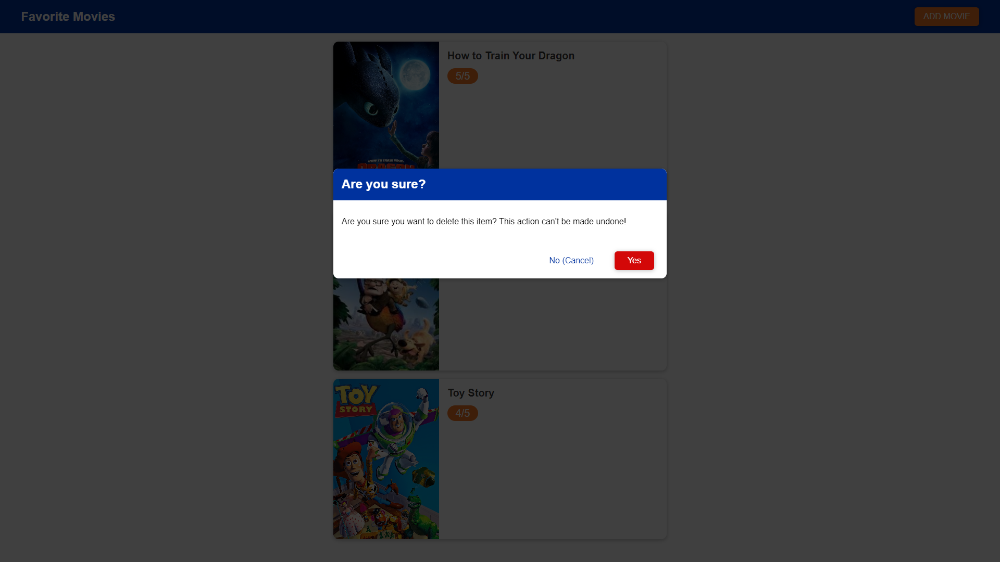
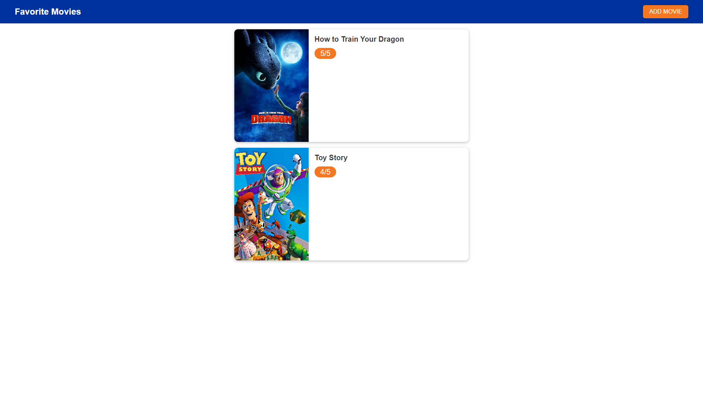

# MovieManager
Here I showcase how I learnt how to utilise JS to work with the DOM from a course by <a href='https://www.udemy.com/user/academind/'>Maximilian Schwarzmüller</a>!

## Add Movie
After the user presses the add movie button in the top right side of the screen this input form will show up. The user must fill in the title of the movie, the image URL, and their rating of the movie.

## Submit
After the user is finished entering the values they're happy with they can then submit the form.

## Rendering Movie
Once the user has pressed submit the movie will render on screen and will utilise all the data they input.

## Multiple Movies
The user can also render multiple movies!

## Delete Movies
If the user is unhappy with a movie they can delete the movie by tapping on it and then pressing "Yes"!

## Removed from Render
After confirming they want the movie to be removed an updated selection of movies will appear!

